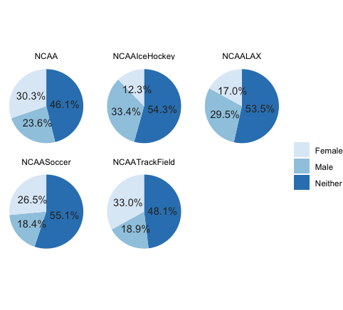
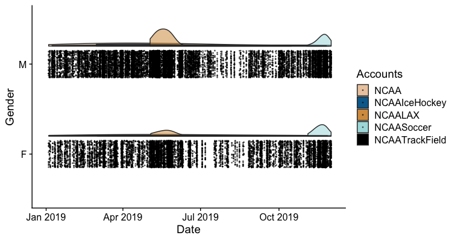

```{r setup, include=FALSE}
knitr::opts_chunk$set(echo = TRUE)
```

#*An Analysis of how the NCAA uses Twitter to promote teams and athletes*

##Abstract

The purpose of the project is to analyze and display how different NCAA Twitter accounts use their platform to relay news to followers. This project is tasked with answering the question of whether there is an imbalance of tweets dedicated to Men's or Women's team and athletes. Women's sports have been historically underrepresented in the media in turn damaging the visibilty and growth of the women's game. Recent campaigns from top-tier brands like Nike or Addidas have recognized the imbalance of media coverage and sought to equalize. Twitter represents just one platform in which the NCAA can promote its sports teams. I analyzed five NCAA affiliated Twitter accounts for Ice Hockey, Lacrosse, Soccer, Track and Field, and NCAA as a whole. Is there a difference for how the NCAA reports Men's and Women's teams? If so, does this highlight a larger gender bias? The results indicate that tweet imbalances do exist, however the gender favored varies across the different accounts analyzed. 

******

##Introduction

During the 2019 World Cup, the US Women's National Soccer Team saw some of the highest media ratings in broadcast history. For the months of July and August the USWNT dominated the media and in doing so they brought a conversation about women's equality, specefic to sports, to front and center. However, the coverage of the USWNT in 2019 was an anomaly. Women's sports are coverage in totality is only a sliver of media attention male athletes recieve. A structural imbalance of coverage is detrimental to efforts to grow women's sports as a whole. Media coverage is only a one part to achieving equality, but visibility of women's sports brings funding and resources that are consistently an inhibitor to expanding the women's game. Specific to collegiate athletics, the NCAA should be motivated to represent its teams equally. This project attempts to find a gender bias specific to NCAA Twitter accounts in an effort to contribute the larger conversation of female media coverage.


##Method

I chose to analyze Division I NCAA Twitter accounts that included both Men's and Women's coverage as some sports have seperate Twitters for the men and women divisions. I chose these five sports and their Twitter accounts: Ice Hockey (@NCAAIceHockey), Track and Field (@NCAATrackField), Lacrosse (@NCAALAX), Soccer (@NCAASoccer), and the general NCAA account (@NCAA). Most sports are covered by the general NCAA account. For each account I pulled its 1,000 most recent tweets from its timeline.

I used R to code for gender by flagging names or other gendered words and pronouns mentioned in a tweet. In order to guess gender from names I used Social Security data that includes the most commonly associated gender with a name. Tweets that were flagged as 'Female' contained at least one mention of a typically female name or pronoun with no mention of a male name or pronoun. The same is true for 'Male' tweets.

##Results

An imbalance of gendered tweets was evident in all five accounts to some degree. NCAA, Track and Field, and Soccer showed a slight favoring of female tweets. However, Ice Hockey and Lacrosse showed the greatest disparity of male and female tweets, heavily favoring male tweets. 




I also analyzed tweet frequency of each account relative to each month. The figure below shows tweet activity from all five accounts in 2019. The graphic is a density plot of each account's tweets seperated by gender. Each point under the graph is a tweet. 




##Conclusion

My goal through this project was to find a gender imbalance of tweet frequency by NCAA affiliated accounts. I did find an imbalance of gendered tweets that was significant in the Ice Hockey and Lacrosse account. These findings highlight a broader issue of unequal media coverage between male and female sports. Media coverage is essential for growing the women's game. Twitter represents one facet of media coverage that is devoid of most financial incentives linked to broadcast media that often impede equal sports coverage. My findings also may be sensitive to disparities that exist in the number of men's and women's teams that exist for each sport. Are there more tweets about male hockey players, for example, simply because there are more men's hockey teams? More research should look into the correlation betwen number of teams and amount of tweets. I would also like to apply the structure of this project to analyze college/university Twitter accounts more specifically.The results from my project add the larger conversation of equality in women's sports whether that be in professional settings, Olympic and National teams, or at the collegiate level. 

